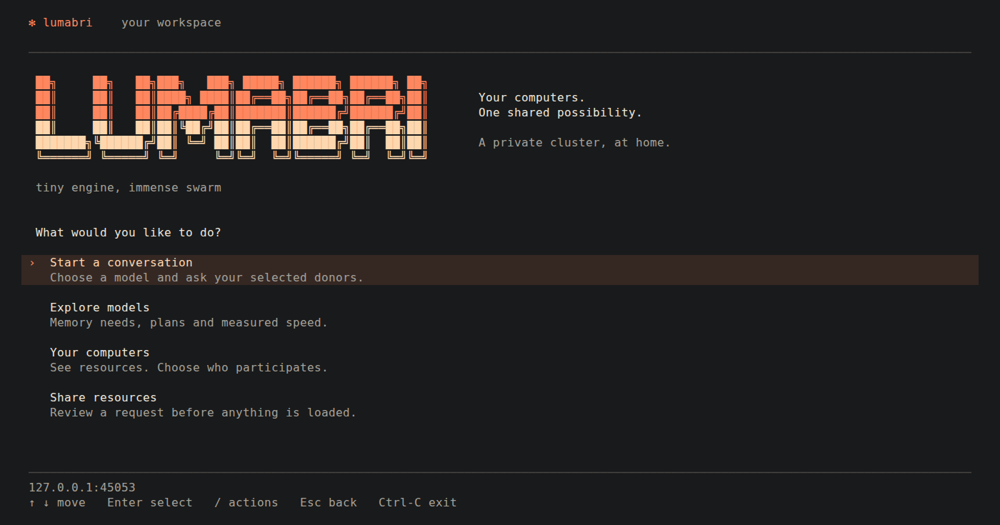
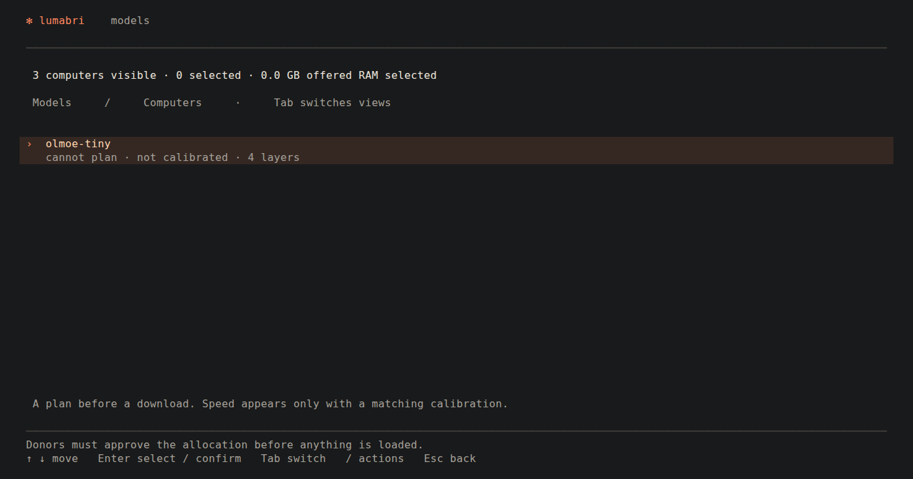
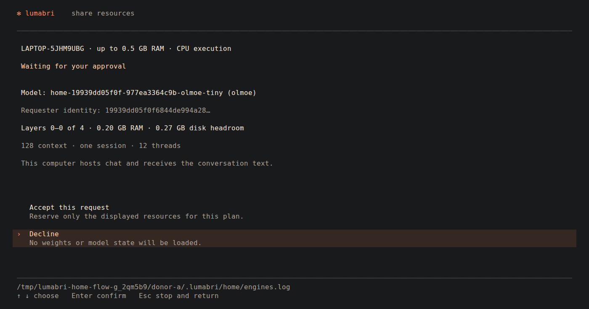

# Your computers. One shared model.

Lumabri connects your computers into a private household cluster using
[Colibri](https://github.com/JustVugg/colibri). Choose a model, select the
computers that may help, and ask their owners to approve the allocation.
The interface and runtime are written in C.



## Start here

Build from source with a compatible Colibri checkout:

```sh
make ENGINE=/path/to/colibri/c
./lumabri
```

After launch, use **arrow keys and Enter**. Press **/** for workspace actions
and **Esc** to go back. Use a terminal at least 60 columns by 28 rows.

1. On one computer, open **/ → /create**. Keep Lumabri running.
2. On your other computers, open **/ → /join**. Select the household found
   on your LAN, compare its identity with **/create** on the owner computer,
   then enter the household key. Manual address entry remains available.
   Only share that key with your household.
3. Open **/settings** to set the maximum RAM you offer. Choose
   **Share resources** on each computer that may participate.
4. On the requesting computer, set **/settings** to the folder containing
   your existing Colibri model directories.
5. Open **Your computers**. Press Enter to select donors; none is selected
   automatically. Tab switches to **Models**.
6. Choose a model and review its plan. Enter requests approval from the
   participating donors. Chat starts only after all approve and the complete
   chain is ready.

The creating computer saves its key and restarts its household when Lumabri
reopens. The tracker uses **TCP 47300**, household services use **TCP
47301–47315**, and LAN discovery uses **UDP 47300**. Restarting does not require
opening another random port. If the fixed range is occupied, Lumabri reports
the conflict instead of silently choosing ports outside it.

The computers still need direct LAN connectivity. On Windows with mirrored
WSL networking, open **/network** on the Windows computer: after your explicit
approval and the Windows administrator prompt, it allows only those ports
from the detected private subnet. The firewall stays enabled. The same action
can remove Lumabri's rules. Keep the `tools` folder beside the built binary.
Other systems use their normal firewall permissions. Guest Wi-Fi isolation,
VPN routing and WSL NAT mode can still prevent direct discovery or connections;
the helper does not reconfigure those networks. If your LAN address changes,
use **/join** to rediscover the household rather than guessing an address.

Apple Terminal uses a compatible 256-colour palette with a contrasting
selection background. Other terminals use detected colour support. For
diagnostics, `LUMABRI_COLOR=16`, `256`, `truecolor` or `none` overrides detection;
`NO_COLOR=1` disables the canvas colours. Normal use needs no colour command.

## A plan before a download



The catalogue reads the model folders and the household inventory. It shows
offered RAM, detected hardware, placement and missing resources. **Not
calibrated** means there is no matching speed measurement—not zero speed.
A detected GPU is not a promise that this execution path uses it.

The household path currently admits **one CPU, resident Segment plan** with
verified model sizing and source weights on the requesting computer. It
distributes contiguous layer ranges, not isolated experts. Each donor keeps
the state for its layers; the chosen chat host receives the conversation text.
The chat connection itself does not mount or download a checkpoint.

Adding computers can make a model fit when it would not fit on one machine.
It does not automatically make each chat faster.

## Sharing is your decision



A request shows the model, layer range, RAM budget, disk headroom and whether
the computer also hosts chat. **Decline is selected initially.** Move to
Accept and press Enter only when you agree.

No model is loaded until every participating donor accepts. Rejection or
cancellation releases the plan. Esc stops sharing; closing chat releases its
allocations.

Inside chat, your messages and the streamed answers stay in the transcript.
Type **/** for command suggestions, use arrows to choose and Tab to complete.
**/help**, **/debug**, **/reset** and **/quit** provide help, diagnostics, a new
conversation and exit.

## What has actually been checked?

- Linux-environment build with warnings treated as errors.
- A real encrypted tracker, two donor TUIs, Colibri Segment engines and hosted
  generation using a tiny synthetic OLMoE checkpoint on loopback.
- Arrow/Enter navigation, all-party approval, rejection, slash completion,
  terminal restoration and resource release.
- The images above are frames from that integration test, not performance
  claims for a large model or a multi-computer LAN.

**Not yet certified:** a physical household LAN, native Windows or macOS
(including Intel Macs), GPU household execution, all model families,
multi-session household use, or transparent recovery after losing a donor.
WSL testing is not native Windows certification.

Adapter registration is broader than tested household execution. A checkpoint
appearing in the catalogue does not make its sizing or backend supported.
There are no promised tok/s or automatic “best model” recommendations.

## Development and diagnostics

```sh
make test ENGINE=/path/to/colibri/c
python3 tests/integration/home_flow_test.py --models-dir /path/to/tiny-model-folder
```

The second command starts a loopback integration test with real engines; it
requires a compatible small OLMoE checkpoint. Normal household use stays in
the TUI.

See [repository layout](docs/REPOSITORY.md), [Segment engineering](SEGMENT_DIRECT.md)
and [release checks](PRODUCTION.md) for developer details. Expert/Hybrid,
public-network protocols and advanced CLI tools remain available for
development; they are not extra steps in the household interface.
